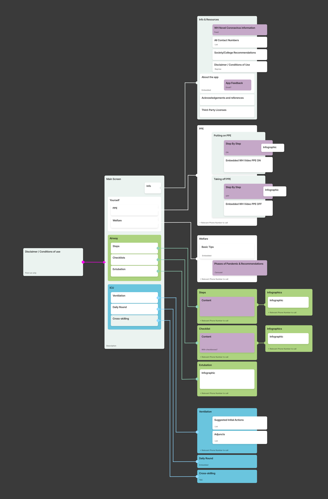
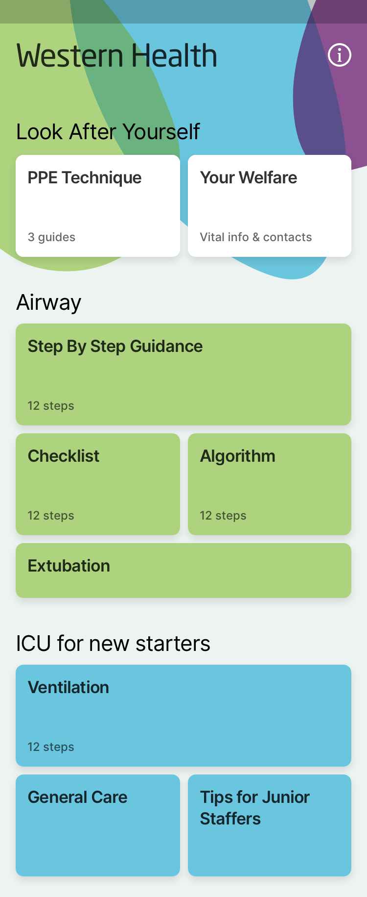

# WHAC19 - Western Health Anaesthesia Covid-19

The WHAC19 app is a tool to safeguard the welfare of Western Health anaesthetists during COVID-19 and provide instant access to the most up-to-date information for time-critical procedures to ensure optimal patient care.  This app will contain information for frontline medical staff on subjects such as:

- Putting on and taking off PPE (Personal Protective Equipment)
- Taking care of your own welfare
- Intubation and Extubation checklists and steps
- Ventilation suggested initial actions and adjuncts
- ICU General Care
- ICU Tips your daily round and cross skilling
- Contact details and newsfeeds

Currently under development by a community of volunteers.

If you've never used Github here's a [Github101.md](docs/GITHUB101.md) to get you started with the basics.

## The Plan

We will rapidly build out functionality and screens. The plan is to ship early, and ship often, deploying new builds at least once a day via CI.

Currently all data will be stored inside the app, with no CMS or web services. The app should have minimal logic, and instead just focuses on providing important information in a mobile friendly format.

### Information architecture

The app will have these screens and sections:

### Screenshots

The complete set of designs are in Zeplin, but this gives some indication of how the the app will look:

  
  
  

  
  
  

## Contributors
In no particular order, the following people have contributed to building the project:

* Gregg Miller - Initial Development and ideas
* Matt Kelsh - Design
* Marc Edwards - Design
* Luke Sleeman - Project organiser
* Alessandro Favero - Flutter Dev
* Maksim Lin - Senior Flutter dev, CI
* Mike Hughes - Lead Flutter dev, CI & CD
* Adam Koch - Flutter dev
* Brett Morgan - Flutter dev
* Eric Jiang - Flutter dev
* Dylan Lange - Flutter dev
* Jonathan Galtieri - Anaesthetist
* Ben Blackman - Anaesthetic registrar
* Fabien Dade - ICU registrar
* Alice Gynther - Anaesthetist
* Kim Nguyen - Flutter dev
* Bramley - Flutter dev
* Suesi Tran - Flutter dev
* June Chen - Flutter dev
* Joshua Case - Flutter dev
* Poornima Sivakumar - Documentation
* Fabio - Documentation
* Sally Chung - Testing and general support
* Carlos Melegrito - Design

## License

This project is licensed under the Apache 2.0 - see the `LICENSE-2.0.txt` file for details.

Western Health logos belong solely to Western Health may be subject to their copyrights and trademarks, and are not available under the same license as the rest of this application.

## Emergency contacts

For any urgent requests relating to this app you can contact luke.sleeman@gmail.com - It will go to Luke's phone.  You can also DM Luke through [GDG Melbourne's slack](http://bit.ly/join_gdgslack) - DM `@luke.sleeman`.

## Acknowledgments

So many people have worked together to make this project happen, and helped out in so many ways 🥰

Firstly a huge thanks to [all our contributors](#Contributors); Our designers, developers and all the medical staff.  Your work is what is making this project happen.

The entire [GDG Melbourne](https://www.gdgmelbourne.com) community for pulling together on this.

Several companies who have provided support and employee time, including Itty Bitty apps, and Art Processors. 

Code Magic for additional build minutes and support and Manichord for additional build minutes.

Slack for upgrading our workspace free of charge.

Apple and Google for help with expedited app reviews and listings.

Those who have given helpful and timely advice, including Byron Teu.

I've probably forgotten a bunch of people, so if you have done something and we have missed out on you; I'm deeply sorry, and appreciate your contribution.  Message Luke Sleeman and I will make sure you get added ❤️❤️❤️.
