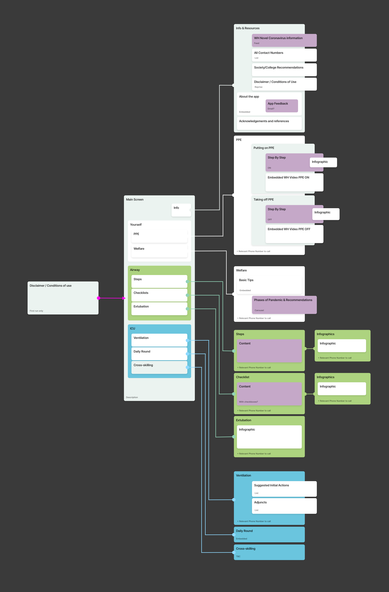

# Western Health COVID-19 app

A tool to safeguard the welfare of Western Health anaesthetists during COVID-19 and provide instant access to the most up-to-date information for time-critical procedures to ensure optimal patient care.  This app will contain information for frontline medical staff on subjects such as:

- Putting on and taking off PPE (Personal Protective Equipment)
- Taking care of your own welfare
- Intubation checklists and steps
- Ventilation suggested initial actions and adjuncts
- ICU General Care
- ICU Tips for junior staffers
- Contact details and newsfeeds

Currently under development by a community of volunteers.

[](https://codemagic.io/apps/5e75f4bfdd1d6d000a198e90/5e75f4bfdd1d6d000a198e8f/latest_build)

## Development process

Everything is co-ordinated through github issues.  The current development process is:

👨‍⚕️👩‍⚕️ **Greg Miller** and other Western Health staff provide features, content and suggestions to the design team via GitHub issues.  Greg & Co can create new issues for features to add and either assign to Marc or label them `design`.

⬇️

👩‍🎨👨‍🎨 **Marc Edwards** and other designers help design and specify features.  They add design guidance, into the issues.  [These issues currently need design guidance.](https://github.com/Western-Health-Covid19-Collaboration/wh_covid19_app/issues?q=is%3Aopen+is%3Aissue+label%3Adesign).  Once they have done their ✨ magic ✨ the issue should be labeled as 'Ready for dev'

⬇️
 
 👩‍💻👨‍💻 **Developers** pick up [ready for Dev issues](https://github.com/Western-Health-Covid19-Collaboration/wh_covid19_app/issues?q=is%3Aopen+is%3Aissue+label%3A%22Ready+for+Dev%22+) and submit PRs to the project when then get approved and merged.
 
 Check out the full list [issues page](https://github.com/Western-Health-Covid19-Collaboration/wh_covid19_app/issues) to get an overview of everything that is happening.  Feel free to flag an issue with `design` at any time to summon a designer.
 
⬇️

🖥 **CI** builds the app and deploys to phones via firebase app distribution.

## The Plan

The app will have these screens and sections:



We will rapidly build out functionality and screens. The plan is to ship early, and ship often, deploying new builds at least once a day via CI.

Currently all data will be stored inside the app, with no CMS or web services. The app should have minimal logic, and instead just focuses on providing important information in a mobile friendly format.

## Getting Started & Development

You will need to install and setup Flutter to develop this application. You can read more on how to set up Flutter [here](https://flutter.dev/docs/get-started/install).

**Tip!**: If you are using Visual Studio Code as your IDE (Code Editor), the [Flutter extension](https://marketplace.visualstudio.com/items?itemName=Dart-Code.flutter) is really useful and helpful to perform multiple actions such as:

- the installation of depencies
- running the application

### Installing dependencies

To install dependencies, simply run `flutter pub get` in your terminal.

### Developing the app

#### iOS

Initialise an instance of an iOS Simulator or connect physical iOS device, navigate to the cloned repo and run from root:

```sh
# from terminal

open -a simulator

cd desktop/muhnee-app
flutter run -d "iPhone"
```

#### Android

##### Keychain Certificate Setup

1. Download the `google-services.json` configuration file from the Firebase Project and move it to the directory `<PROJECT-ROOT>/android/app`
2. Get the Android Keychain by:

   ```
   keytool -list -v -keystore ~/.android/debug.keystore -alias androiddebugkey -storepass android -keypass a
   ndroid
   ```

3. Copy either the SHA1 or the SHA256 certificate fingerprint onto the Android App on [Firebase Console]()

##### Development

If you have a device plugged in just run:

```
flutter run
```

Otherwise if you have setup [Android Studio](https://developer.android.com/studio) and/or the Android Software Development Kit (SDK) you can run it over a virtual Android emulator using the Android Debug Bridge (ADB). Just simply run:

```
flutter run adb
```

##### Releasing

1. Create a Keystore

   If you have an existing keystore, skip to the next step. If not,create one by running the following at the command line:

   On Mac/Linux, use the following command:

   ```sh
   keytool -genkey -v -keystore ~/key.jks -keyalg RSA -keysize 2048 -validity 10000 -alias key
   ```

   On Windows, use the following command:

   ```sh
   keytool -genkey -v -keystore c:/Users/USER_NAME/key.jks -storetype JKS -keyalg RSA -keysize 2048 -validity 10000
   ```

2. Create a file named <app dir>/android/key.properties that contains a reference to your keystore:

   ```
   storePassword=<password from previous step>
   keyPassword=<password from previous step>
   keyAlias=key
   storeFile=<location of the key store file, such as /Users/<user name>/key.jks>
   ```

3. You will also need to update the SHA1/SHA256 Certificate Fingerprint in Firebase Console with the signing certificate.

   To get the certificate run:

   macOS/Linux:

   ```sh
   keytool -list -v -alias key -keystore ~/key.jks
   ```

   Windows:

   ```sh
   keytool -list -v -alias key -keystore c:/Users/USER_NAME/key.jks
   ```

## Contributing

Check our [issues page](https://github.com/Western-Health-Covid19-Collaboration/wh_covid19_app/issues) for tasks to work on.

When contributing to this repository, please first discuss the change you wish to make via slack, issue, or email or any other method with the owners of this repository before making a change.

Currently the project is being primarily co-ordinated via the GDG Melbourne slack group. You can join GDG Melbourne's slack via [this invite](http://bit.ly/join_gdgslack). DM `@luke.sleeman` on GDG Melbourne slack to be invited to the channel being used for co-ordination.

### Pull Request Process

- Develop your work in a branch. Branch names should be prefixed with `feature`, `tech`, or `bugfix` depending on what is being done in them. eg: `feature\update-readme`
- Open a pull request into master. Be sure to include a detailed description in your pull request. Other contributors will comment on your code or approve it
- Please be sure to note the build status of your PR reported by the Codemagic CI
- Once your pull request has been approved, please merge into master.

## Authors

* Gregg Miller - Initial Development and ideas
* Matt Kelsh - Design
* Marc Edwards - Design and management
* Luke Sleeman - Organising people and general dogsbody 😁
* Alessandro Favero - Flutter Dev
* Maksim Lin - Flutter dev & CI
* Mike Hughes - Flutter dev & CI
* Brett Morgan - Flutter dev
* Adam Koch - Flutter dev
* Eric Jiang - Flutter dev, and QA
* Adam Koch - Flutter dev
* Dylan Lange - Flutter dev


## License

This project is licensed under the Apache 2.0 - see the `LICENSE-2.0.txt` file for details.

## Emergency contacts

For any urgent requests relating to this app you can contact luke.sleeman@gmail.com - It will go to Luke's phone.  You can also DM Luke through [GDG Melbourne's slack](http://bit.ly/join_gdgslack) - DM `@luke.sleeman`.

## Acknowledgments

🎩 Huge hat tip to everybody providing advice, helping out, etc including: Gregg Miller, Matt Kelsh, Mike Hughes,  Alessandro Favero, Maksim Lin, Brett Morgan, Adam Koch, Eric Jiang, Hsiu-Mei Huang, Sean Woodhouse, Matt Delves, Kim Nguyen, Martin from CM, Itty Bitty Apps, Bramley

I've probably forgotten a bunch of people, so if you have done something and we have missed out on you; I'm deeply sorry, and appreciate your contribution ❤️. Message Luke Sleeman and he will make sure you get added.
