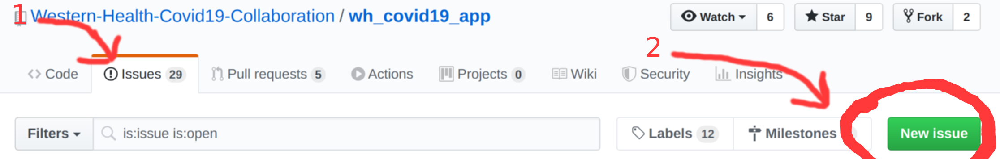

This document is aimed at getting started with github for Western Health staff.

If you're a developer there's more info at [README.md](../README.md).

# Quick links

- [Medic related issues](https://github.com/Western-Health-Covid19-Collaboration/wh_covid19_app/issues?q=is%3Aissue+is%3Aopen+label%3AMedic)

- [Design related issues](https://github.com/Western-Health-Covid19-Collaboration/wh_covid19_app//labels/design) need designer's attention

- [Ready for dev issues](https://github.com/Western-Health-Covid19-Collaboration/wh_covid19_app/issues?q=is%3Aissue+is%3Aopen+label%3A%22Ready+for+Dev%22) are already scrubbed for questions so devs can jump in and start coding. If it's your first attempt to contribute to this project look also at [Good first issue](https://github.com/Western-Health-Covid19-Collaboration/wh_covid19_app/issues?q=is%3Aissue+is%3Aopen+label%3A%22good+first+issue%22).

- To install github mobile app head to [Android mobile link](market://details?id=com.github.android&hl=en) (alternative [Laptop link for android app](https://play.google.com/store/apps/details?id=com.github.android&hl=en) or [Apple placeholder]() store. You can login or sign up from there, for free.

- Install the Western Health Covid19 app head at [Android placeholder]() or [Apple placeholder]() store. 
- If you're on Android you can also download last minute versions from slack: go into the `#covid-19-app-builds` channel, find the last post from codemagic and download the `.apk` file. This is actually a good opportunity to hunt for the freshest bugs.

- [Join GDG Melbourne's slack](http://bit.ly/join_gdgslack) with either work or personal email

- [Join github](https://github.com/join?source=header-home) with either work or personal email

# How can you help?

Look into [Medic related issues](https://github.com/Western-Health-Covid19-Collaboration/wh_covid19_app/issues?q=is%3Aissue+is%3Aopen+label%3AMedic), then review them and see what it is the developers may be asking for. Most often this will be a further copy (written information) and content or a breakdown of an algorithm/ checklist. 

If you think you can help you can add a comment with either a simple reply or follow up question. Developers are a friendly bunch and won't be critical if you don't provide what they are looking for. You'll need to be logged in in order to make comments.

A good rule of thumb is that if you can succintly put all your thoughts into a couple paragraphs and don't expect a lot of back and forth, it's ok. If it's complicated, other ways of communication will be more efficient.
  
You can always ask for clarification by contacting Gregg directly on the general channel on Slack GDG Melbourne.  A good way to get a feel for the process and how issues are resolved might be to look at previous issues with Gregg's name assigned and the type of answer he has given. Generally, if it doesn't answer the developer then they will have responded.

There's also a private slack channel `#covid-19-app`. If you're going to get commited to the project it's worth checking with Gregg how to get access to it.

# What is Github?
Github is a good place where developers write and combine their individual `source code` (computer instructions, the magic bits that power all sorts of electronic apps) with each other so they can collaborate in teams when building complex applications. 

That's only one of the tools they use to get stuff done. While other tools are very technical, Github has a couple of things that are meant to be used by people who are not technical at all.

## Is it free?
Yes.

Everything in the scope of this project is free and you don't need a credit card or any other means of payment. Although there are some paid features in Github, none of them are necessary.

## Do I need an account?
There are many ways to participate in this project. Some ways need you to log into github, some don't.

- If you want to report a problem and follow up on it, the best way would be to create an `issue` (more below). That requires a github login.
- If you want to download the app you do NOT need a github account (see the links at the top of this page). 
- If you still want to participate but don't want to do it through github, you can still join us on slack (a kind of social chat app that software developers love) at [GDG Melbourne's slack](http://bit.ly/join_gdgslack). Go into the `#general` channel, and some friendly face may be able to help you out. 

You can use any email you wish when signing up - it can be your work email or personal one, there's no drawbacks in using either. The only time it should matter is if you lose the password and need to receive a reset password link. 

Note that the slack `#general` channel is not specific to this app, so different people have different priorities and may even not be aware that this app exists. However if you're stuck or lost that's a good place for asking for help.

## What is an "issue"? How do I create it?

Github helps its users communicate each other through `"issues"`. Think of it as a tunneled conversation about a specific narrow topic. 

We create `issues` for different purposes, such as features we want to have, or bugs that were found. It's very easy to create an issue, and good practice says that you'll need to:

- search or browse for existing issues, so we don't report the same thing twice
- make sure you're logged in
- After that, hit the green button 

 
- create a short, easy to remember title for it
- create the first comment, explaining as clear and concise as possible what the goal is

### What happens next?

- After an `issue` is created, you and other people can add comments to it
- Eventually some developer would assign herself/himself to work on it
- Eventually that developer or another one will finish the work on it
- The `source code` (computer instructions) produced as part of that work follows a set of procedures - like a medical protocol - that ends up in producing a new version of the app, that would be automatically updated into mobile's phones. This can happen very quickly or very slowly, depending on a number of factors such as urgency, developer's available time and technical hurdles.
- After all work and procedures are wrapped up the `issue` is closed. 

That's the gist of it. You can find more info on [README.md](../README.md) under the "Development process" section.

### Tips for creating and handling issues

Good titles for new issues follow a common format such as 
"As a user I'd like to":
- see a video about doff
- share a pdf over email
- collapse and and uncollapse the text about ...
etc etc 

More:

- You can edit your own comments at any time. However it's not advised unless for minor corrections, since that can break the communication flow (what if somebody replied to something you deleted?). Good practice tells us to ADD text to the end of the comment, explaining what we changed. For example after editing the text to make a critical correction you'd add at the bottom of the comment something like "Edit: removed the requirement to have a video and replaced it with a bullet list".
- Developers may get stuck with something either a) deeply technical, b) deeply domain specific (that means it's something that only Health professionals are suited to answer), or anywhere in between. They may add comments with their questions, and once their concerns are settled they may resume work on the `issue`.
- Only team members with special privileges can assign tasks to either themselves or others. It's expected to learn a bit more of ins and outs of github before a person can do that. Because with those bigger powers come bigger responsibilities. However you can still drop a comment telling other people that you're taking care of it, and another one when you're done (optionally with the result of your findings).
- You can still find it in the issues list, but you'd have to manually change the filter which is always defaulted to display only open `issues`.
- If you'd like to get the attention to a specific person that may be oblivious to the conversation you can use that person's handle just like in Twitter. For example: "We should check with @greggmiller how to handle this problem". This is quite handy because  people tend to get involved in several issues, each one to a different degree, until they're closed. So if you notice that there's something without progress for an abnormal amount of time it's a good way to nudge it in motion again.

# FAQ
 
